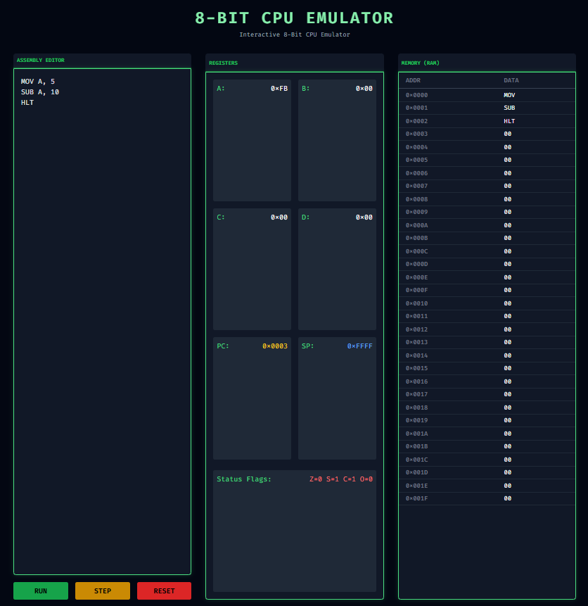

# 🕹️ Full-Stack 8-Bit CPU Emulator

> A custom, interactive 8-bit CPU emulator built from scratch using a Java/Spring Boot backend and a modern web frontend.



## 📖 Overview
This project simulates the core components of a retro 8-bit CPU. The core processing engine (Arithmetic Logic Unit, Fetch-Decode-Execute cycle, and state management) is written in **Java** using **Spring Boot**. The UI is built using **JavaScript, HTML, and Tailwind CSS**, allowing users to write Assembly code in the browser, send it to the backend via a REST API, and visualize the CPU's internal state in real-time.

## ⚙️ Architecture & Functionality

### 1. CPU Registers
The CPU features 4 general-purpose 8-bit registers and 2 special-purpose 16-bit registers:
- **A, B, C, D:** 8-bit registers used for math and data manipulation (holds values from `0x00` to `0xFF`).
- **PC (Program Counter):** 16-bit register that tracks the memory address of the next instruction to execute.
- **SP (Stack Pointer):** 16-bit register (currently mocked at `0xFFFF`) for future stack implementation.

### 2. The ALU & Status Flags
The Arithmetic Logic Unit automatically calculates standard processor flags after `MOV`, `ADD`, and `SUB` operations:
- **Z (Zero):** Set to `1` if the result of an operation is exactly zero.
- **S (Sign):** Set to `1` if the result is negative (i.e., the 7th bit is `1`).
- **C (Carry):** Set to `1` if an addition operation exceeds 255 (overflows 8 bits), or acts as a Borrow flag during subtraction.
- **O (Overflow):** Set to `1` if signed arithmetic overflow occurs (e.g., adding two positive numbers yields a negative result).

### 3. Instruction Set
Currently, the emulator supports a custom subset of x86/8085 style assembly:
- `MOV dest, src`: Moves an 8-bit value (decimal or hex) or the contents of one register into another.
- `ADD dest, src`: Adds a value/register to the destination register.
- `SUB dest, src`: Subtracts a value/register from the destination register.
- `HLT`: Halts CPU execution.

### 4. Memory Mapping
The UI visualizes a 32-byte chunk of RAM. As instructions are parsed, the backend maps the OpCodes into sequential memory addresses (e.g., `0x0000`, `0x0001`), providing a visual representation of how code is loaded into memory.

---

## 📝 Example Assembly Programs

You can copy and paste these into the emulator's code editor!

### Example 1: Basic Math & Data Movement
```assembly
; Load registers with immediate values
MOV A, 10
MOV B, 0x14   ; 0x14 is 20 in decimal

; Add B into A (A becomes 30 / 0x1E)
ADD A, B

; Copy result to C
MOV C, A
HLT
```

### Example 2: Triggering the Overflow & Carry Flags (8-bit wrapping)
```assembly
; The max value of an 8-bit register is 255 (0xFF)
MOV A, 255

; Adding 2 will cause the register to wrap around to 1 (0x01)
; This sets the Carry (C) flag to 1!
ADD A, 2
HLT
```

### Example 3: Subtraction & Zero/Sign Flags
```assembly
MOV A, 50
SUB A, 50
; A is now 0. The Zero (Z) flag is set to 1.

SUB A, 10
; A is now -10 (wrapped to 0xF6). The Sign (S) flag is set to 1.
HLT
```

---

##  How to Run Locally

### Prerequisites
- Java Development Kit (JDK) 11+
- Maven
- Node.js & npm

### Installation

1. **Clone the repository:**
   ```bash
   git clone <your-github-repo-url>
   cd 8bit-emulator
   ```

2. **Run the Java Backend:**
   Open a terminal in the root directory and run:
   ```bash
   mvn spring-boot:run
   ```
   *The backend will start on `http://localhost:8080`.*

3. **Start the Frontend:**
   Open a second terminal, navigate to the frontend folder, and start the development server:
   ```bash
   cd frontend-js
   npm install
   npm run dev
   ```
   *Open `http://localhost:5173` (or the port provided by Vite/http-server) in your browser.*

## 🛠️ Built With
- **Backend:** Java 17, Spring Boot 3
- **Frontend:** Vanilla JavaScript, HTML5, Tailwind CSS, Vite
- **Architecture:** RESTful API, Cross-Origin Resource Sharing (CORS)